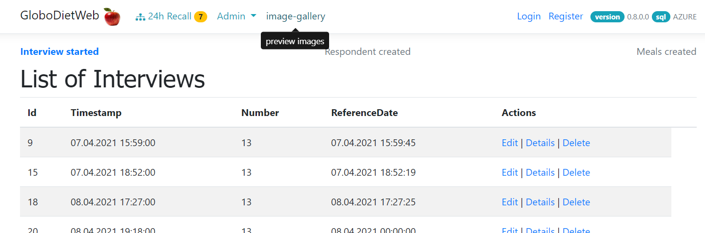
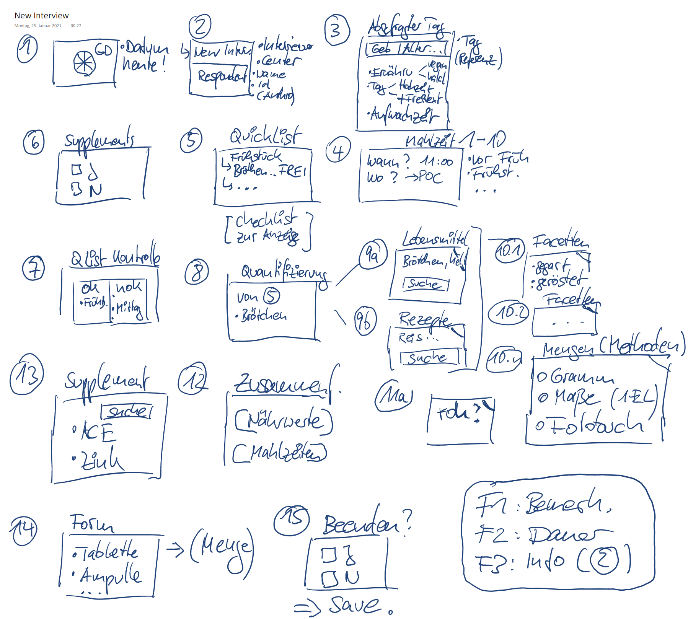

# GloboDietWeb

## about

- proof-of-concept for nutrition interviews
- possible replacement for currently used desktop applications
- persistent storage for demo data
- role management for logins

## impressions

### website



### desktop process



## built with

### components

- framework used:  
- data storage in [](https://azure.microsoft.com)
- [](https://code.visualstudio.com/)
- tested on 

### used packages

```xml
  <ItemGroup>
    <PackageReference Include="DextersLabor" Version="0.9.2" />
    <PackageReference Include="Microsoft.AspNetCore.Identity.EntityFrameworkCore" Version="7.0.2" />
    <PackageReference Include="Microsoft.AspNetCore.Mvc.NewtonsoftJson" Version="7.0.2" />
    <PackageReference Include="Microsoft.EntityFrameworkCore" Version="7.0.2" />
    <PackageReference Include="Microsoft.EntityFrameworkCore.InMemory" Version="7.0.2" />
    <PackageReference Include="Microsoft.EntityFrameworkCore.Proxies" Version="7.0.2" />
    <PackageReference Include="Microsoft.EntityFrameworkCore.SqlServer" Version="7.0.2" />
    <PackageReference Include="Microsoft.EntityFrameworkCore.Tools" Version="7.0.2">
      <PrivateAssets>all</PrivateAssets>
      <IncludeAssets>runtime; build; native; contentfiles; analyzers; buildtransitive</IncludeAssets>
    </PackageReference>
    <PackageReference Include="Microsoft.Extensions.Identity.Stores" Version="7.0.2" />
    <PackageReference Include="Microsoft.VisualStudio.Web.CodeGeneration.Design" Version="7.0.3" />
    <PackageReference Include="NLog" Version="5.1.1" />
  </ItemGroup>
```

### security manager

- refer to [doc](https://learn.microsoft.com/en-us/aspnet/core/security/app-secrets?view=aspnetcore-7.0&tabs=linux)
- user-secret is generated via

```csharp
dotnet user-secrets init
```

[](https://microsoft.com/windows/)

- secret will be stored here: `%APPDATA%\Microsoft\UserSecrets\<user_secrets_id>\secrets.json`


- secret is here: `~/.microsoft/usersecrets/<user_secrets_id>/secrets.json`

- create a file `secrets.json`

> **note:** if the secret is already present - manually create the secrets file in the folder structure nd paste the content ✅

## deploying via github actions

- azure portal:  overview ➡️ download publish profile
- github repo settings: add this file as secret
- if github actions tab is not visible - check in repo settings
- in github: settings - security - secrets - actions - new repos secret
- paste content of publish profile, name it `AZURE_WEBAPP_PUBLISH_PROFILE`
- ❗ do not publish this file
- use this template for github actions and save it under /.github/workflows